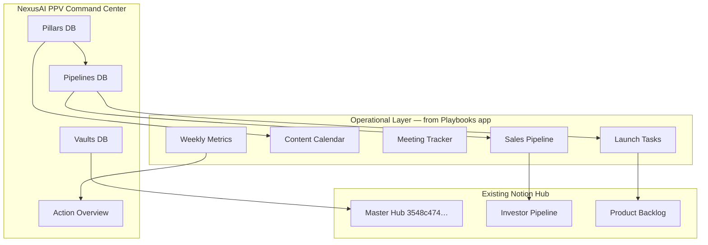

# NexusAI PPV Workspace — August Bradley Model

This blueprint maps **NexusAI Playbooks** project management, tracking, and insights into the **PPV Life Operating System** by August Bradley: **Pillars → Pipelines → Vaults**.

> Deploy with: `pnpm notion:deploy-ppv` (see [deployment-guide.md](./deployment-guide.md))

---

## Architecture Overview

---

## PPV Core (August Bradley)

| Layer | Purpose | NexusAI mapping |
|-------|---------|-----------------|
| **Pillars** | Long-term domains of focus — your “why” areas | Product, GTM, Finance, Brand, Ops, Customer Success |
| **Pipelines** | Active projects, goals, and workflows in motion | 90-day roadmap phases, launches, beta, deals |
| **Vaults** | Durable reference knowledge — playbooks & frameworks | docs-seed strategy, GTM, sales enablement, metrics |

### Action Zone (daily execution)

Linked views from the deployment script:

- **Today’s Pipelines** — filter: Stage = Active, Due ≤ 7 days
- **Weekly Metrics Review** — Monday 9 AM cadence (from `ARG Builder — Weekly Metrics Dashboard.md`)
- **Founder Daily Checklist** — embedded page from `ARG Builder — Founder's Daily Launch Checklist.md`

---

## Six NexusAI Pillars

| Pillar | Vision | Primary pipelines | Vault categories |
|--------|--------|-------------------|------------------|
| **Product** | Ship NexusAI Playbooks as the multi-brand ops platform | SaaS core, AI Hub polish, template export | Architecture, roadmap, feature prioritization |
| **GTM & Sales** | 10 founding customers, $5K MRR by Day 90 | Cold outreach, demos, PH launch, dinners | Battle cards, demo scripts, objection library |
| **Finance** | Runway + unit economics clarity | MRR tracking, Stripe, investor pipeline | Forecasting, pricing, IR dashboard |
| **Brand & Content** | Thought leadership → inbound pipeline | LinkedIn calendar, nurture emails | Content calendar, press kit, one-pager |
| **Operations** | Reliable deploy + team rhythm | Railway prod, CI, weekly digests | Deploy runbooks, team playbooks |
| **Customer Success** | Retention via content health + onboarding | Private beta, trial nurture | Health scoring, onboarding sequences |

---

## Operational Databases (from existing Playbooks build)

These mirror what the app already tracks in admin dashboards and scheduled crons.

### Sales Pipeline

Maps to: `AdminLeadsPage`, `AdminLeadScoresPage`, `AdminGrowthDashboardPage`, Close CRM sync

| Property | Type | Notes |
|----------|------|-------|
| Company | Text | |
| Contact | Text | |
| Stage | Select | New → Contacted → Qualified → Demo → Proposal → Won/Lost |
| MRR Value | Number | |
| Lead Score | Number | 0–100 from `leadScoring.ts` |
| Source | Select | Demo, ROI calc, organic, referral, LinkedIn |
| Next Action | Text | |
| Last Contact | Date | |

### Content Calendar

Maps to: `OpsCanvas LinkedIn Content Calendar.md`, `AdminContentCalendarPage`

| Property | Type |
|----------|------|
| Title | Title |
| Channel | LinkedIn, Blog, PH, Email, Video |
| Status | Idea → Draft → Scheduled → Published |
| Publish Date | Date |
| Pillar | Relation → Pillars |

### Meeting Tracker

Maps to: `AIMeetingNotesPage`, ops leader dinners, demo calls

| Property | Type |
|----------|------|
| Name | Title |
| Date | Date |
| Type | Demo, Dinner, Investor, Team, Partner |
| Attendees | Text |
| Notes | Text |
| Follow-ups | Text |

### Launch Tasks

Maps to: `docs/roadmap/90-day-plan.md`, `AdminKanbanPage`, Product Backlog

| Property | Type |
|----------|------|
| Task | Title |
| Status | To Do, In Progress, Done, Blocked |
| Phase | Phase 0–4 from 90-day plan |
| Due | Date |
| Pillar | Relation |
| Priority | Critical → Low |

### Weekly Metrics

Maps to: `ARG Builder — Weekly Metrics Dashboard.md`, `scheduledWeeklyReview.ts`, `scheduledLeadsDigest.ts`

Four quadrants seeded: **Acquisition**, **Activation**, **Revenue**, **Product** — each metric row with 90-day targets.

---

## Vault Seed Index (reference links, not bulk import)

The deployment script creates **Vault entries** pointing to repo paths — not copying all 525 docs-seed files (per blueprint preservation policy).

| Vault entry | Source path |
|-------------|-------------|
| 90-Day Implementation Roadmap | `docs/roadmap/90-day-plan.md` |
| Weekly Metrics Dashboard | `apps/playbooks/docs-seed/ARG Builder — Weekly Metrics Dashboard.md` |
| Founder's Daily Launch Checklist | `apps/playbooks/docs-seed/ARG Builder — Founder's Daily Launch Checklist.md` |
| GTM Strategy | `apps/playbooks/docs-seed/Go-to-Market Strategy: OpsCanvas by ARG Builder.md` |
| LinkedIn Content Calendar | `apps/playbooks/docs-seed/OpsCanvas LinkedIn Content Calendar.md` |
| Product Hunt Launch Guide | `apps/playbooks/docs-seed/OpsCanvas Product Hunt Launch Guide.md` |
| Startup Metrics Dashboard Design | `apps/playbooks/docs-seed/ARG-Builder: Startup Metrics Dashboard Design.md` |
| Competitive Battle Cards | App: `/admin/battle-cards` + `ARG Builder — Competitive Battle Card.md` |
| Template Bundles | `apps/playbooks/shared/templateBundles.ts` |
| NexusAI Positioning | `docs/product/positioning.md` |
| Pricing | `docs/product/pricing.md` |
| Railway Deploy Runbook | `docs/deploy/railway.md` |

---

## Integration with Existing Notion Hub

From `apps/playbooks/docs-seed/notion-existing-structure.md`:

| Existing | ID | PPV relationship |
|----------|-----|------------------|
| Master Hub | `3548c474-cdec-81ad-8401-fe7a629344d0` | Parent for PPV Command Center |
| Investor Pipeline | `collection://0e57772c-…` | Link Finance pillar pipelines |
| Product Backlog | `collection://043e77fc-…` | Sync with Launch Tasks |
| Product Workspace | `35b8c474-cdec-816c-8b47-fa8e16e62047` | Vault: product docs |

---

## Slack & Other Integrations

Slack, Close CRM, and Stripe data stay in their systems; Notion holds **decision records** and **weekly roll-ups**:

- Monday 8 AM — leads digest fields → Sales Pipeline + Weekly Metrics
- Monday 9 AM — weekly review → Product quadrant metrics
- Trial nurture milestones → Launch Tasks + GTM pillar notes

See `Follow-Up 6: External Tool Integrations.md` for future bidirectional sync spec.
