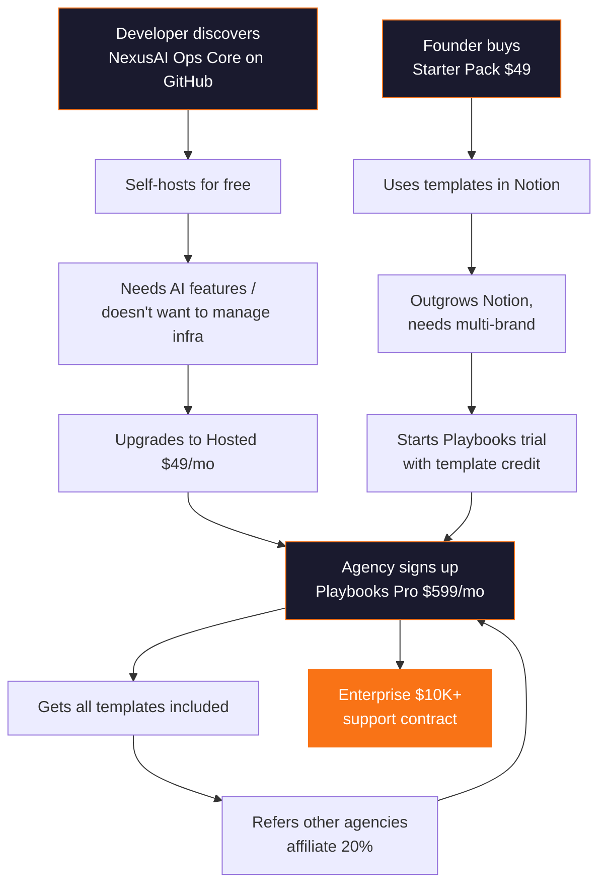

# The NexusAI Three-Path Flywheel

## How All Three Paths Work Together

Most startups pick one go-to-market strategy. NexusAI runs three that **feed each other**:



## Flywheel Mechanics

### Loop 1: Templates → SaaS
```
Buy template ($49) → Use in Notion → Hit limits → 
See "Import to NexusAI Playbooks" CTA → Start trial → 
Convert to paying customer ($299/mo)
```
**Conversion target:** 10% of template buyers start trial, 30% of trials convert = **3% template-to-SaaS**

### Loop 2: OSS → Hosted → SaaS
```
Star on GitHub → Self-host → Need AI/backups → 
Upgrade to Hosted ($49/mo) → Need multi-brand → 
Upgrade to Playbooks ($299/mo)
```
**Conversion target:** 5% of stars try self-host, 20% upgrade to hosted, 15% upgrade to Playbooks

### Loop 3: SaaS → Templates → Referrals
```
Paying customer → Gets templates included → 
Shares with network → Referral credit → 
New customer signs up
```
**Viral coefficient target:** 0.3 (every 3 customers bring 1 new customer)

## Content Strategy Across Paths

The **280+ existing documents** are the atomic unit reused everywhere:

| Content Asset | Templates (Path 2) | Playbooks (Path 1) | Ops Core (Path 3) |
|---------------|--------------------|--------------------|-------------------|
| Individual SOPs | Sold in bundles | Pre-loaded in demo workspaces | Seed data for self-hosters |
| Category structure | Bundle organization | Workspace organization | Default taxonomy |
| Analytics data | "Most downloaded" social proof | In-app benchmarks | Example dashboard |
| Process flows | PDF/visual exports | Interactive persona pages | Demo content |

## Launch Sequence (Not Parallel)

```
Month 1          Month 2          Month 3
─────────────────────────────────────────
[Templates]  →   [SaaS Beta]  →   [OSS Launch]
  $49-199          $299-999/mo       Free → $49/mo
  Gumroad          Private beta      GitHub + PH
  2 weeks          6 weeks           4 weeks
```

**Why this order:**
1. **Templates first** — Zero engineering, immediate revenue, validates demand
2. **SaaS second** — Builds on template buyer list, recurring revenue
3. **OSS third** — Requires extracted core, benefits from SaaS credibility

## Anti-Patterns to Avoid

| Don't | Do Instead |
|-------|------------|
| Launch all three simultaneously | Sequential launch with 2-week overlap |
| Open-source everything | Open core engine; keep AI + analytics proprietary |
| Compete with Notion on features | Own the "multi-brand ops" niche |
| Give templates away free | Price at $49+ to anchor SaaS value |
| Hardcode demo personas | Generic "Acme Agency" + "Beta Client" demo workspaces |
| Build mobile apps in Year 1 | Responsive web + PWA is sufficient |

## Key Metrics to Track

| Metric | Formula | Target |
|--------|---------|--------|
| Template → Trial rate | Trials / Template sales | 10% |
| Trial → Paid rate | Paid / Trials | 30% |
| Monthly churn | Lost MRR / Total MRR | < 5% |
| NRR (Net Revenue Retention) | (Start + Expansion - Churn) / Start | > 110% |
| OSS → Hosted rate | Hosted / GitHub stars | 2% |
| CAC (Customer Acquisition Cost) | Marketing spend / New customers | < $500 |
| LTV (Lifetime Value) | ARPU × avg lifetime months | > $5,000 |
| LTV:CAC ratio | LTV / CAC | > 3:1 |
